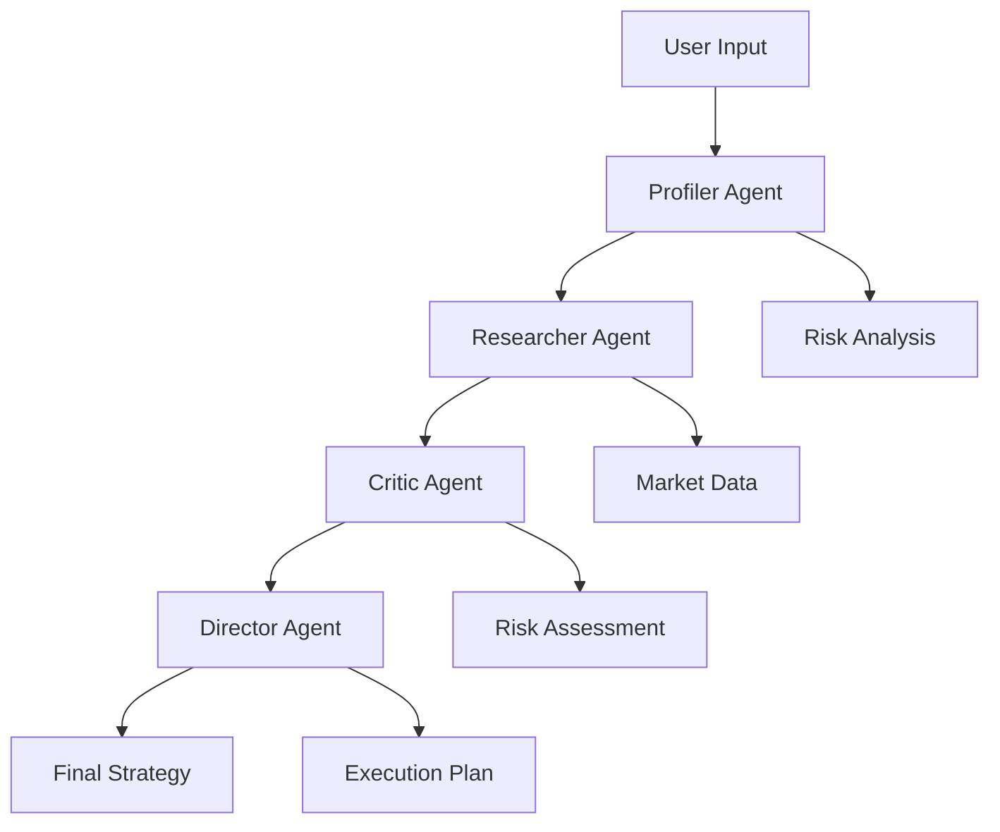
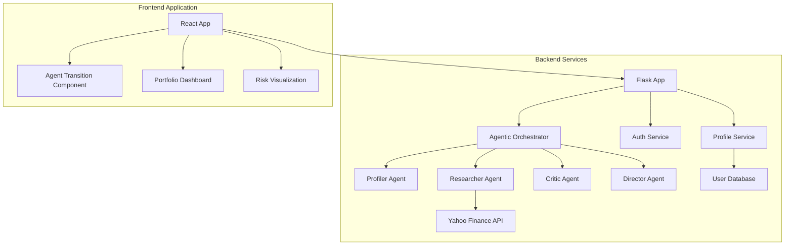
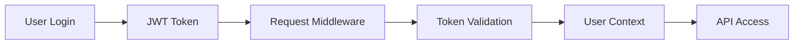
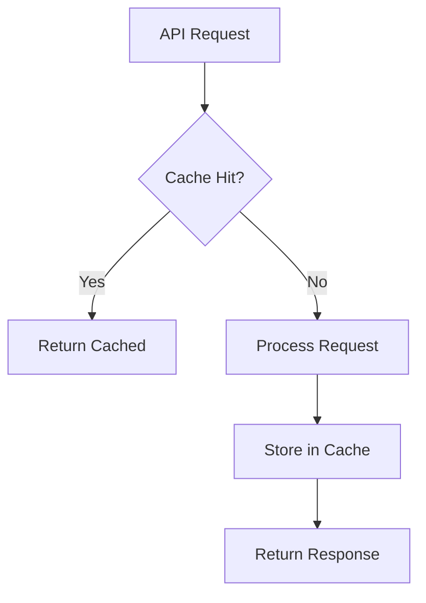
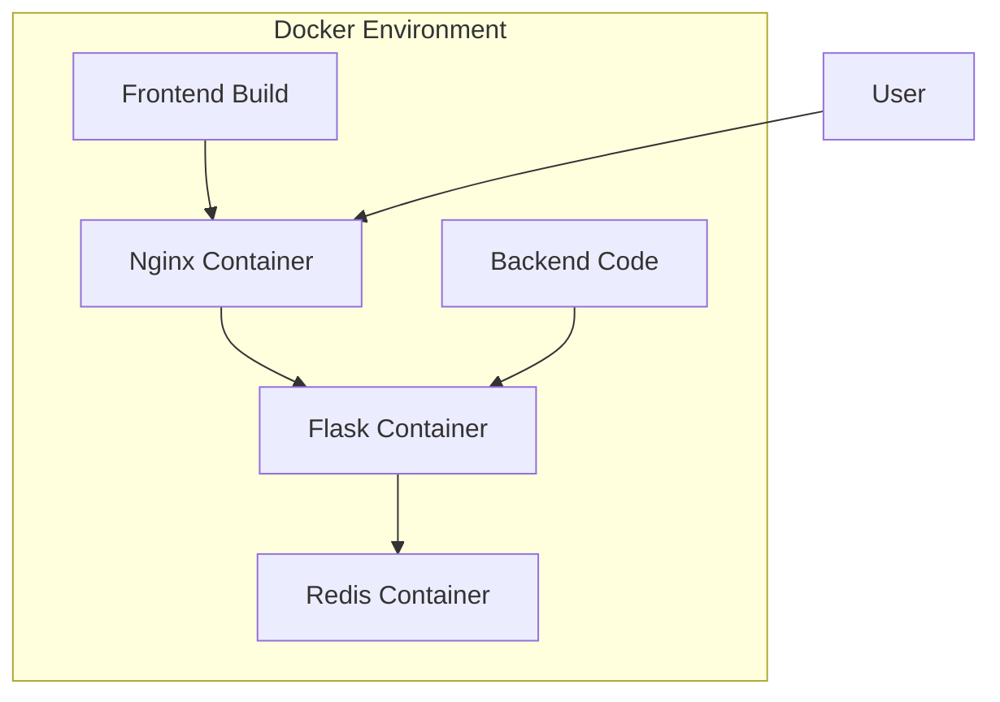
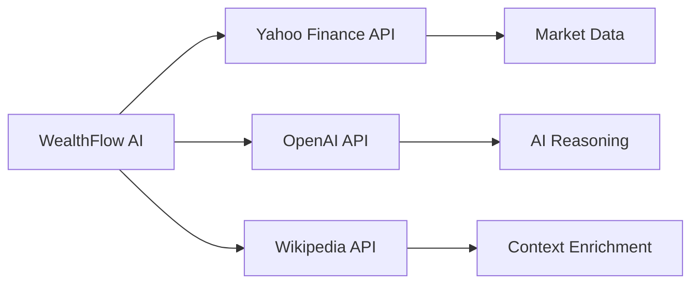

# 🏗️ WealthFlow AI System Architecture

## Overview

WealthFlow AI implements a sophisticated 4-stage agentic pipeline that transforms raw financial data into actionable investment strategies. The architecture is designed around the principle of separation of concerns, with each agent specializing in a specific aspect of investment analysis.

## 🧠 Agentic Pipeline Architecture

### System Design Philosophy

The architecture follows a **deterministic multi-agent pattern** where each agent has a specific responsibility and produces structured outputs that feed into the next stage. This ensures:

- **Consistency**: Same inputs always produce same outputs
- **Auditability**: Each decision can be traced back to specific agent logic
- **Modularity**: Agents can be updated independently
- **Scalability**: Pipeline can be parallelized where possible

### 4-Stage Agent Pipeline



#### Stage 1: Profiler Agent
**Responsibility**: Behavioral Analysis and Risk Assessment

**Input**: User profile data (age, salary, risk tolerance)
**Output**: Structured risk profile and strategy parameters

```python
class ProfilerAgent:
    def analyze_profile(self, age, salary, risk_tolerance):
        return {
            'risk_score': 1-10,
            'risk_band': 'low|moderate|high|very-high',
            'safe_aggressive_ratio': {'safe': 0.5, 'aggressive': 0.5},
            'investment_horizon': 'short|medium|long-term',
            'strategy_bias': 'conservative|balanced|growth|aggressive'
        }
```

**Key Functions**:
- Risk scoring algorithm based on age, salary, and preferences
- Investment horizon determination
- Strategy bias calculation
- Safe vs aggressive allocation ratio

#### Stage 2: Researcher Agent
**Responsibility**: Market Discovery and Asset Research

**Input**: Risk profile from Profiler Agent
**Output**: Curated investment opportunities with real-time data

```python
class ResearcherAgent:
    def discover_assets(self, profile_analysis):
        return {
            'recommended_categories': ['stocks', 'etfs', 'bonds'],
            'specific_assets': [...],
            'market_overview': {...},
            'research_summary': '...'
        }
```

**Key Functions**:
- Asset category selection based on risk profile
- Specific ticker recommendation
- Real-time market data enrichment via Yahoo Finance API
- Market overview and sentiment analysis

#### Stage 3: Critic Agent
**Responsibility**: Risk Assessment and Vulnerability Analysis

**Input**: Research results from Researcher Agent
**Output**: Comprehensive risk analysis and mitigation strategies

```python
class CriticAgent:
    def analyze_risks(self, research_results, profile_analysis):
        return {
            'asset_risks': [...],
            'portfolio_risks': {...},
            'mitigation_strategies': [...],
            'stress_test_scenarios': {...}
        }
```

**Key Functions**:
- Individual asset risk scoring
- Portfolio-level risk assessment
- Stress testing scenarios
- Risk mitigation strategies

#### Stage 4: Director Agent
**Responsibility**: Strategy Synthesis and Execution Planning

**Input**: Risk analysis from Critic Agent
**Output**: Final investment strategy with execution roadmap

```python
class DirectorAgent:
    def synthesize_strategy(self, profile, research, risk):
        return {
            'executive_summary': '...',
            'final_allocation': [...],
            'execution_roadmap': {...},
            'performance_projections': {...}
        }
```

**Key Functions**:
- Final asset allocation synthesis
- Execution platform recommendations
- Performance projections
- Monitoring and rebalancing plans

## 🏛️ System Architecture

### Backend Architecture



### Component Breakdown

#### Backend Components

**Flask Application (`app.py`)**
- Main application server
- Route handlers for API endpoints
- Request/response management
- Error handling and logging

**Agentic Orchestrator (`core/orchestrator.py`)**
- Pipeline coordination
- Agent execution management
- Result aggregation
- Error handling and fallbacks

**Agent Modules (`core/agents/`)**
- Specialized AI agents for each pipeline stage
- Independent business logic
- Structured input/output interfaces
- Unit testable components

**Route Handlers (`routes/`)**
- API endpoint definitions
- Request validation
- Authentication middleware
- Response formatting

#### Frontend Components

**React Application (`frontend/src/`)**
- Modern React 19 with hooks
- Component-based architecture
- State management with Context API
- Responsive design with Tailwind CSS

**Agent Visualization (`components/AgentTransition.jsx`)**
- Real-time pipeline visualization
- Framer Motion animations
- Progress tracking
- User feedback

**Data Visualization (`components/PortfolioChart.jsx`)**
- Chart.js integration
- Interactive portfolio charts
- Risk visualization
- Performance tracking

### Data Flow Architecture

#### Request Flow
1. **User Request** → Frontend React App
2. **API Call** → Flask Backend
3. **Authentication** → JWT Token Validation
4. **Pipeline Execution** → Agentic Orchestrator
5. **Agent Processing** → 4-Stage Pipeline
6. **Result Aggregation** → Director Agent
7. **Response** → JSON API Response
8. **UI Update** → React State Update

#### Data Persistence
- **User Data**: In-memory storage (development) / Database (production)
- **Market Data**: Real-time API calls with caching
- **Session Data**: JWT tokens with expiration
- **Cache**: Redis for market data and API responses

### Security Architecture

#### Authentication & Authorization


**Security Layers**:
1. **JWT Authentication**: Stateless token-based auth
2. **Request Validation**: Input sanitization and validation
3. **Rate Limiting**: API endpoint protection
4. **CORS Configuration**: Cross-origin request security
5. **HTTPS Enforcement**: SSL/TLS for production

#### Data Protection
- **Encryption**: Sensitive data encryption at rest
- **API Keys**: Environment variable storage
- **User Privacy**: No personal data sharing
- **Audit Logging**: Request tracking and monitoring

### Performance Architecture

#### Caching Strategy


**Cache Layers**:
1. **Market Data**: Redis cache with TTL
2. **API Responses**: Short-term response caching
3. **Static Assets**: CDN and browser caching
4. **Database Queries**: Query result caching

#### Scalability Considerations
- **Horizontal Scaling**: Stateless application design
- **Load Balancing**: Nginx reverse proxy
- **Database Scaling**: Read replicas and connection pooling
- **API Rate Limiting**: Prevent abuse and ensure stability

### Deployment Architecture

#### Container Architecture


**Container Components**:
- **Nginx**: Reverse proxy, SSL termination, static serving
- **Flask App**: Python application server
- **Redis**: Caching and session storage
- **Frontend**: Built React application

#### Environment Configuration
- **Development**: Local development with hot reload
- **Staging**: Production-like environment for testing
- **Production**: Optimized for performance and security

### Monitoring & Observability

#### Logging Strategy
```python
# Structured logging format
{
    "timestamp": "2024-01-15T10:30:00Z",
    "level": "INFO",
    "service": "profiler-agent",
    "user_id": "user_123",
    "action": "profile_analysis",
    "duration_ms": 150,
    "risk_score": 7
}
```

#### Health Checks
- **Application Health**: `/health` endpoint
- **Database Connectivity**: Connection pool monitoring
- **External APIs**: Yahoo Finance API status
- **Cache Status**: Redis connectivity check

#### Performance Metrics
- **Response Times**: API endpoint latency
- **Pipeline Duration**: Agent processing times
- **Error Rates**: Failed requests and exceptions
- **User Activity**: Request patterns and usage

### Integration Architecture

#### External API Integration


**API Management**:
- **Rate Limiting**: Respect API quotas
- **Error Handling**: Graceful degradation
- **Fallback Strategies**: Multiple data sources
- **Data Validation**: Ensure data quality

#### Third-Party Services
- **Market Data**: Yahoo Finance API
- **AI Services**: OpenAI/Anthropic for reasoning
- **Authentication**: JWT token management
- **Monitoring**: Application performance monitoring

### Future Architecture Enhancements

#### Microservices Migration
- **Agent Services**: Independent agent microservices
- **API Gateway**: Centralized routing and management
- **Service Mesh**: Inter-service communication
- **Event Streaming**: Real-time data processing

#### Advanced AI Integration
- **Machine Learning Models**: Custom prediction models
- **Neural Networks**: Deep learning for pattern recognition
- **Reinforcement Learning**: Adaptive strategy optimization
- **Natural Language Processing**: Enhanced user interaction

#### Cloud-Native Architecture
- **Kubernetes**: Container orchestration
- **Serverless Functions**: AWS Lambda for specific tasks
- **Managed Databases**: Cloud database services
- **CDN Integration**: Global content delivery

---

## 🎯 Architecture Benefits

### Modularity
- **Independent Agents**: Each agent can be developed and tested separately
- **Loose Coupling**: Minimal dependencies between components
- **Easy Maintenance**: Changes to one agent don't affect others

### Scalability
- **Horizontal Scaling**: Stateless design enables easy scaling
- **Load Distribution**: Pipeline stages can be distributed
- **Resource Optimization**: Efficient resource utilization

### Reliability
- **Error Isolation**: Failures in one agent don't cascade
- **Graceful Degradation**: Fallback strategies for failures
- **Monitoring**: Comprehensive health checks and logging

### Testability
- **Unit Testing**: Each agent can be tested independently
- **Integration Testing**: Pipeline testing with mock data
- **End-to-End Testing**: Full workflow validation

This architecture ensures WealthFlow AI can handle complex investment workflows while maintaining high performance, security, and reliability standards suitable for financial applications.
